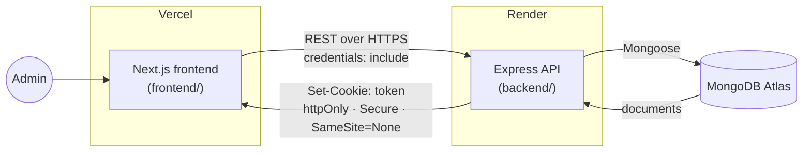
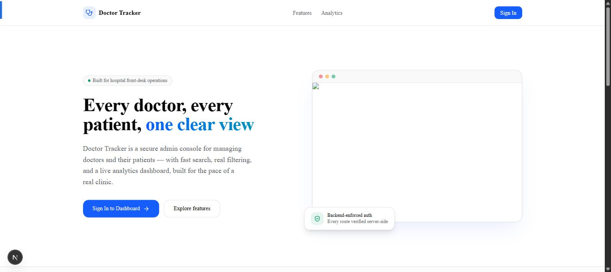
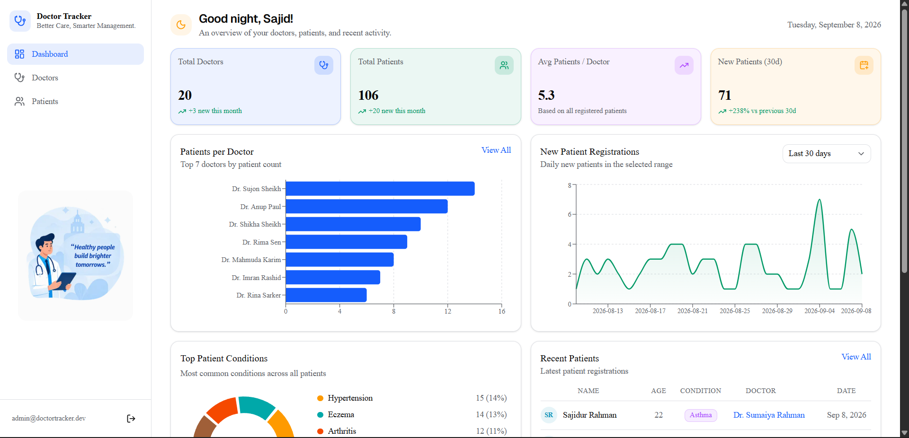
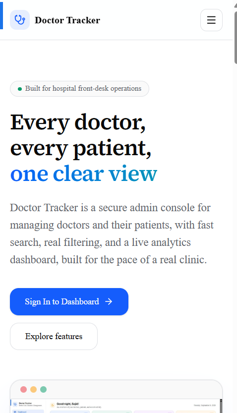
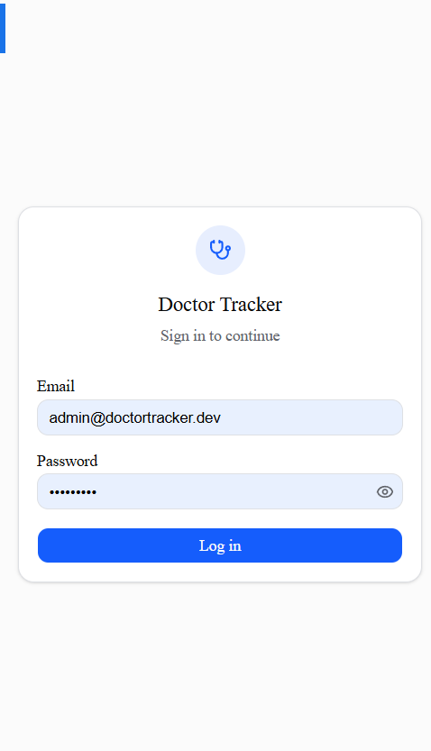
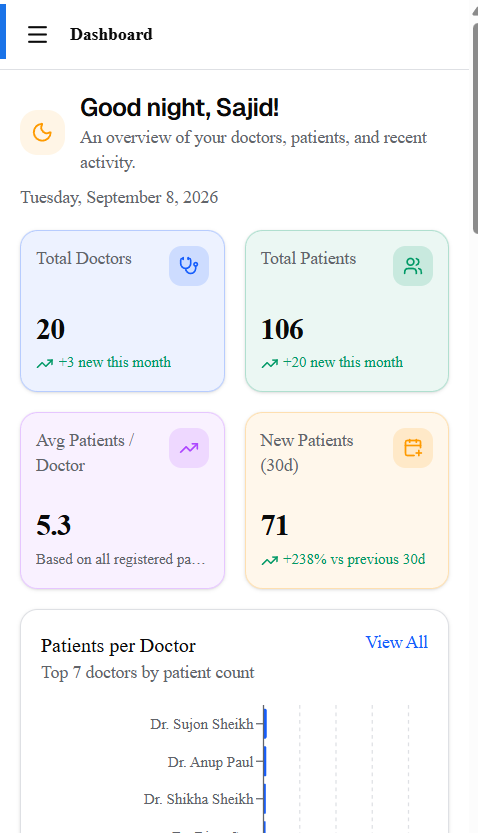
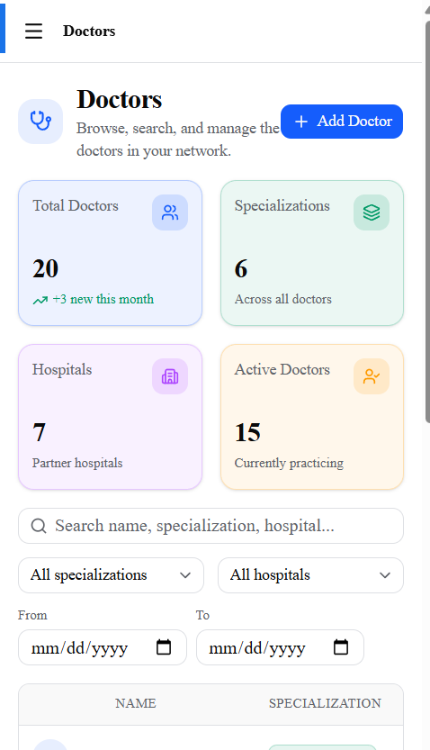
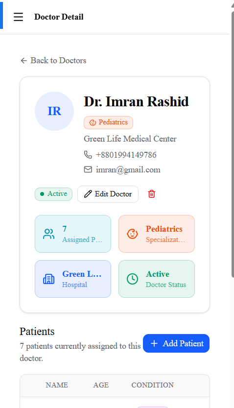
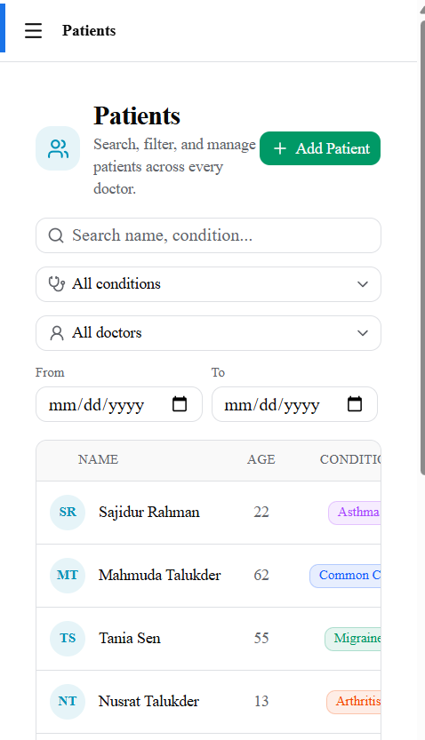

# Doctor Tracker

**A secure admin console for managing hospital doctors and their patients — search, filter, paginate, and track everything from a live analytics dashboard.**


**Live app:** [doctor-tracker-web.vercel.app](https://doctor-tracker-web.vercel.app) &nbsp;·&nbsp; **Live API:** [doctor-tracker-backend-jn3d.onrender.com](https://doctor-tracker-backend-jn3d.onrender.com) ([`/health`](https://doctor-tracker-backend-jn3d.onrender.com/health)) &nbsp;·&nbsp; **Demo login:** `admin@doctortracker.dev` / `admin1234`

> The API runs on Render's free tier, which spins down after inactivity. The first request against a cold instance can take up to ~50s to respond — that's expected, not a bug.

## Table of Contents

- [Description](#description)
- [Key Features](#key-features)
- [Tech Stack](#tech-stack)
- [System Architecture](#system-architecture)
- [Authentication Approach](#authentication-approach)
- [Setup Guide](#setup-guide)
- [Available Scripts](#available-scripts)
- [Data Model & Performance](#data-model--performance)
- [Dashboard & Analytics](#dashboard--analytics)
- [Deployment](#deployment)
- [Technical Decisions](#technical-decisions)
- [Visual Evidence](#visual-evidence)
- [Repository Links](#repository-links)

## Description

Doctor Tracker is an admin tool for a hospital's front desk staff to manage doctors and the patients assigned to them. An authenticated admin can register doctors, add patients under each one, reassign patients between doctors, and search, filter, and paginate through both lists — all backed by a live dashboard summarizing headcounts, per-doctor patient loads, condition breakdowns, and registration trends over time. It's built as a single Git repository holding two independently deployed applications: a Next.js frontend and an Express/MongoDB REST API, talking to each other over HTTPS across two different hosting providers.

## Key Features

**Doctor Management**
- Create doctors (name, specialization, hospital, phone, email — all required, phone/email format-validated)
- List, edit, and delete doctors
- Full-text search across name/specialization/hospital, plus filter by specialization, hospital, and creation date range
- Doctor detail view showing that doctor's patients, with add/delete inline

**Patient Management**
- Dedicated cross-doctor `/patients` page — create, edit, and delete
- Reassign a patient to a different doctor via a doctor-select dropdown in the edit form
- Full-text search across name/condition, plus filter by condition, doctor, and date range
- Filters and pagination are URL-synced (bookmarkable, survive a refresh)

**Dashboard & Analytics**
- All-time metrics: total doctors, total patients, patients per doctor, condition breakdown, 5 most recent patients
- Range-scoped metrics (7d / 30d / 90d): new-patient registration trend and a period-over-period comparison against the prior equal-length window
- Rendered as stat cards, a patients-per-doctor bar chart, a date-trend area chart, and a condition-breakdown chart (Recharts)

**Authentication**
- JWT-based login against a seeded admin account (no public sign-up, by design)
- Rate-limited login (5 attempts / 15 min / IP)
- Every protected route independently verifies the session — see [Authentication Approach](#authentication-approach)

## Tech Stack

| | Frontend | Backend |
|---|---|---|
| Language | TypeScript | TypeScript |
| Framework | Next.js (App Router), React | Node.js, Express 4 |
| Styling / UI | Tailwind CSS v4, shadcn/ui, base-ui | — |
| Data / server state | TanStack Query | Mongoose (MongoDB) |
| Forms / validation | React Hook Form + Zod | Zod |
| Charts | Recharts | — |
| Auth | — (consumes backend session) | JWT + bcryptjs |
| Hardening | — | helmet, cors, express-rate-limit |
| Testing | Jest, Testing Library | Jest, Supertest, mongodb-memory-server |

## System Architecture



This is one Git repository ([`Saji-d/doctor-tracker`](https://github.com/Saji-d/doctor-tracker)) with `backend/` and `frontend/` as independent subfolders — not two repos. They deploy separately (frontend to Vercel, backend to Render) and communicate only over REST, exactly as an external client would talk to the API.

**Request lifecycle** for any protected route: the browser sends a `fetch` with `credentials: include` → Express's `cors` middleware checks the request's `Origin` against `FRONTEND_URL` → `requireAuth` verifies the JWT signed into the `token` cookie, 401ing if it's missing or invalid → the route's Zod schema validates the body/query → a service function runs an indexed Mongoose query → the response is shaped as `{ data, pagination }` (lists) or the resource itself → any thrown error is caught by a single centralized error middleware and returned as `{ error: { message, code } }`, never a raw stack trace.

On the frontend, every page is a client component backed by a TanStack Query hook (`useDoctors`, `usePatients`, `useDashboard`, …) that wraps a thin fetch client pointed at `NEXT_PUBLIC_API_URL`. There's no server-side data fetching and no Next.js API routes standing in for backend logic — the frontend talks to the real backend the same way any other client would.

## Authentication Approach

The frontend and backend are deployed on two different domains (`vercel.app` and `onrender.com`). Cookies are scoped to the domain that sets them, so a cookie the backend sets is never visible to the frontend's own server — not even to Next.js middleware, `httpOnly` or not, because the frontend's server never receives it in the first place. That's why there is deliberately **no `middleware.ts`** in this frontend guarding routes by reading a session cookie; that approach cannot work under this topology, not just "wasn't built yet."

Instead, authentication works like this:

1. On login, the backend verifies credentials and sets the JWT into an `httpOnly; Secure; SameSite=None` cookie (`SameSite=None` because the browser still has to attach it to cross-origin `fetch` calls from the frontend's pages).
2. The frontend's `AuthProvider` calls `GET /api/auth/me` once on mount. A `200` means authenticated; a `401` means it isn't. That's the *only* way the frontend ever learns its auth state — it never inspects the cookie itself.
3. The dashboard layout's route guard reads that result and redirects to `/login` when unauthenticated. This is a UX convenience (it avoids flashing protected content) — it is **not** the security boundary.
4. The real boundary is the backend: every protected route runs a `requireAuth` middleware that independently verifies the JWT and returns `401` otherwise. Bypassing the frontend guard entirely (curl, devtools, JS disabled) still hits a backend that enforces auth on its own.

The full write-up, with more of the reasoning, lives in [`backend/README.md`](backend/README.md#technical-decisions) (Technical Decision 1) and [`frontend/README.md`](frontend/README.md#technical-decisions) (Technical Decision 1).

## Setup Guide

**Prerequisites:** Node.js 20+, a MongoDB connection string (Atlas free tier works fine).

```bash
git clone https://github.com/Saji-d/doctor-tracker.git
cd doctor-tracker
```

**1. Backend**

```bash
cd backend
npm install
cp .env.example .env   # fill in the values below
```

`backend/.env.example`:

```dotenv
MONGODB_URI=mongodb+srv://<user>:<password>@<cluster>.mongodb.net/doctor-tracker
PORT=4000
ADMIN_EMAIL=admin@doctortracker.dev
ADMIN_PASSWORD=<choose-a-strong-password>
JWT_SECRET=<random-64+-char-string>
FRONTEND_URL=http://localhost:3000
NODE_ENV=development
```

```bash
npm run seed   # creates the admin user + sample doctors/patients (idempotent)
npm run dev    # http://localhost:4000
```

**2. Frontend** (in a second terminal)

```bash
cd frontend
npm install
cp .env.example .env.local
```

`frontend/.env.example`:

```dotenv
NEXT_PUBLIC_API_URL=http://localhost:4000/api
```

```bash
npm run dev    # http://localhost:3000
```

**3. Log in** at `http://localhost:3000` with the `ADMIN_EMAIL` / `ADMIN_PASSWORD` you set in `backend/.env`, or use the live demo credentials above against the deployed app.

## Available Scripts

| Package | Command | Does |
|---|---|---|
| `backend/` | `npm run dev` | Start the API with hot reload (`tsx watch`) |
| `backend/` | `npm run build` | Compile TypeScript to `dist/` |
| `backend/` | `npm start` | Run the compiled build |
| `backend/` | `npm run seed` | Seed the admin user + sample doctors/patients (idempotent) |
| `backend/` | `npm test` | Run the Jest + Supertest integration suite against an in-memory MongoDB |
| `frontend/` | `npm run dev` | Start the Next.js dev server |
| `frontend/` | `npm run build` | Production build |
| `frontend/` | `npm start` | Serve the production build |
| `frontend/` | `npm run lint` | ESLint |
| `frontend/` | `npm test` | Jest + Testing Library component tests |

Neither package has a dedicated typecheck script — run `npx tsc --noEmit` inside `backend/` or `frontend/` to typecheck without emitting output.

## Data Model & Performance

Three collections: `users` (one seeded admin, no public registration), `doctors`, and `patients` — `doctorId` lives on the patient document (the "many" side), so both "this doctor's patients" and "all patients" stay simple indexed queries.

| Collection | Index | Purpose |
|---|---|---|
| `doctors` | text on `{name, specialization, hospital}` | Search |
| `doctors` | `{specialization: 1}` | Specialization filter |
| `doctors` | `{hospital: 1}` | Hospital filter |
| `doctors` | `{createdAt: -1}` | Date-range filter + default sort |
| `patients` | text on `{name, condition}` | Search |
| `patients` | `{doctorId: 1, createdAt: -1}` (compound) | A doctor's patient list, paginated — the app's hottest query |
| `patients` | `{condition: 1}` | Condition filter |
| `patients` | `{createdAt: -1}` | Date-range filter |

Every list endpoint (doctors, patients, a doctor's patients) supports search, the relevant filters, and offset-based pagination, all combinable and validated with Zod before hitting the database. The compound `{doctorId, createdAt}` index is deliberate: a doctor's paginated patient list is looked up constantly (every doctor-detail page view), so that one query gets a covering index for both its filter and its sort order rather than relying on an in-memory sort.

## Dashboard & Analytics

`GET /api/dashboard/summary?range=7d|30d|90d` returns everything the dashboard needs in one call. Some fields are all-time (total doctors, total patients, patients per doctor, condition breakdown, the 5 most recent patients); two are scoped to the requested range (the daily new-patient trend, and the patient count from the prior equal-length window, for a period-over-period comparison).

All of these are computed as independent, individually-indexed Mongoose queries run concurrently with `Promise.all` — not a single `$facet` aggregation. A `$facet` pipeline shares one leading `$match`, which would either scope every branch to the date range (breaking the "total" metrics) or force the one branch that actually benefits from an index (the date trend) to give it up. Running separate queries keeps every query on its best index while the frontend still only makes one HTTP request. The full reasoning, including the original bug this design fixes, is in [`backend/README.md`](backend/README.md#technical-decisions) (Technical Decision 2).

## Deployment

| Service | Host | Notes |
|---|---|---|
| Frontend | [Vercel](https://vercel.com) | Deploys from `frontend/` |
| Backend | [Render](https://render.com) | Deploys from `backend/`; free tier spins down on inactivity — first request after idle takes ~50s |
| Database | [MongoDB Atlas](https://www.mongodb.com/atlas) | — |

The backend's CORS is locked to a single `FRONTEND_URL` origin, and the auth cookie is set `httpOnly; Secure; SameSite=None` specifically to survive the cross-domain split between Vercel and Render in production.

## Technical Decisions

Two decisions worth calling out specifically (condensed here — full write-ups linked below):

**1. The backend is the sole authentication boundary.** Because the frontend and API live on different domains, no code running on the frontend — Next.js middleware included — can ever see the auth cookie. So the design doesn't pretend otherwise: only the backend inspects the JWT, every protected route enforces it independently via `requireAuth`, and the frontend's route guard is explicitly UX-only. See [`backend/README.md#technical-decisions`](backend/README.md#technical-decisions) and [`frontend/README.md#technical-decisions`](frontend/README.md#technical-decisions).

**2. Dashboard aggregation as parallel queries, not `$facet`.** An earlier design put every dashboard metric inside one `$facet` pipeline with a leading `$match` on the date range, which silently scoped the all-time totals to that range too. The fix wasn't to move the `$match` — it was to stop using `$facet` for this at all, since none of its branches can use an index. `Promise.all` over independent, individually-indexed queries fixes the correctness bug and keeps the date-trend query on its index, while the frontend still gets everything in one response. Full write-up: [`backend/README.md#technical-decisions`](backend/README.md#technical-decisions).

## Visual Evidence

**Landing** — the public page every visitor sees before signing in



**Login**


**Dashboard** — stat cards, patients-per-doctor chart, date-trend chart, and condition breakdown, from real seeded data



**Doctors** — search, specialization filter, date-range filter, and pagination, all combinable


**Doctor detail** — that doctor's patients only, add/delete inline


**Patients** — the cross-doctor view, with condition and doctor filters, inline edit (including reassignment) and delete


**Mobile** — the same landing, login, dashboard, doctors, and patients pages at a real 390px-wide layout viewport (verified `scrollWidth === clientWidth`, i.e. no horizontal overflow, and the nav collapses to a working hamburger menu)

<table>
<tr>
<td></td>
<td></td>
<td></td>
</tr>
<tr>
<td></td>
<td></td>
<td></td>
</tr>
</table>

## Repository Links

- **Repository:** [github.com/Saji-d/doctor-tracker](https://github.com/Saji-d/doctor-tracker) — a single repo, `backend/` and `frontend/` as subfolders
- **Backend deep dive:** [`backend/README.md`](backend/README.md) — full technical decisions, API table, and indexing detail
- **Frontend deep dive:** [`frontend/README.md`](frontend/README.md) — full technical decisions and visual evidence writeup
- **Live app:** https://doctor-tracker-web.vercel.app
- **Live API:** https://doctor-tracker-backend-jn3d.onrender.com
- **Demo admin login:** `admin@doctortracker.dev` / `admin1234`
