<div align="center">

# 🩺 Doctor Tracker

**A secure admin console for managing hospital doctors and their patients — search, filter, paginate, and track everything from a live analytics dashboard.**


**[Live App](https://doctor-tracker-web.vercel.app)** &nbsp;·&nbsp; **[Live API](https://doctor-tracker-backend-jn3d.onrender.com)** ([`/health`](https://doctor-tracker-backend-jn3d.onrender.com/health)) &nbsp;·&nbsp; **Demo login:** `admin@doctortracker.dev` / `admin1234`

> The API runs on Render's free tier and spins down after inactivity — the first request after idle can take up to ~50s. Expected, not a bug.

[Description](#description) · [Features](#key-features) · [Tech Stack](#tech-stack) · [Architecture](#system-architecture) · [Auth](#authentication-approach) · [Setup](#setup-guide) · [Scripts](#available-scripts) · [Data & Performance](#data-model--performance) · [Dashboard](#dashboard--analytics) · [Deployment](#deployment) · [Decisions](#technical-decisions) · [Screenshots](#visual-evidence)

</div>

---

## Description

Doctor Tracker lets a hospital's front-desk staff manage doctors and their patients from one place: register doctors, add patients under them, reassign patients between doctors, and search, filter, and paginate through both lists. A live dashboard summarizes headcounts, per-doctor patient loads, condition breakdowns, and registration trends.

One Git repo, two independently deployed apps: a Next.js frontend and an Express/MongoDB REST API, talking over HTTPS across two different hosts.

## Key Features

**Doctor Management** — create (name, specialization, hospital, phone, email), list, edit, delete · full-text search + specialization/hospital/date filters · detail view with that doctor's patients, add/delete inline

**Patient Management** — dedicated cross-doctor `/patients` page · create, edit, delete · reassign to a different doctor from the edit form · search + condition/doctor/date filters · filters and pagination are URL-synced

**Dashboard & Analytics** — total doctors/patients, patients-per-doctor, condition breakdown, 5 most recent patients (all-time) · new-patient trend + period-over-period comparison (7d/30d/90d) · bar, area, and breakdown charts via Recharts

**Authentication** — JWT login against a seeded admin account, no public sign-up · rate-limited (5 attempts/15min/IP) · every protected route independently verifies the session, see [Authentication Approach](#authentication-approach)

## Tech Stack

| | Frontend | Backend |
|---|---|---|
| Language | TypeScript | TypeScript |
| Framework | Next.js (App Router), React | Node.js, Express 4 |
| Styling / UI | Tailwind CSS v4, shadcn/ui, base-ui | — |
| Data / server state | TanStack Query | Mongoose (MongoDB) |
| Forms / validation | React Hook Form + Zod | Zod |
| Charts | Recharts | — |
| Auth | consumes backend session | JWT + bcryptjs |
| Hardening | — | helmet, cors, express-rate-limit |
| Testing | Jest, Testing Library | Jest, Supertest, mongodb-memory-server |

## System Architecture

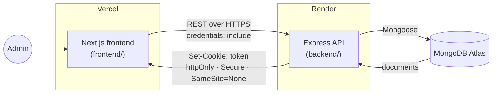

One Git repo ([`Saji-d/doctor-tracker`](https://github.com/Saji-d/doctor-tracker)), `backend/` and `frontend/` as independent subfolders, not two repos. They deploy separately and only ever talk over REST, the same way any external client would.

<details>
<summary><b>Request lifecycle for a protected route</b></summary>
<br>

`fetch(credentials: include)` → CORS checks `Origin` against `FRONTEND_URL` → `requireAuth` verifies the JWT cookie (401 if missing/invalid) → Zod validates the request → an indexed Mongoose query runs → response shaped as `{ data, pagination }` or the resource itself → any error is caught by one centralized error middleware and returned as `{ error: { message, code } }`, never a raw stack trace.

On the frontend, every page is a client component backed by a TanStack Query hook (`useDoctors`, `usePatients`, `useDashboard`, …) wrapping a thin fetch client pointed at `NEXT_PUBLIC_API_URL`. No server-side data fetching, no Next.js API routes standing in for backend logic — the frontend talks to the real backend the same way any other client would.

</details>

## Authentication Approach

Frontend and backend live on different domains (`vercel.app`, `onrender.com`). Cookies are scoped to the domain that sets them, so the frontend's own server can never see a cookie the backend set, not even in Next.js middleware. That's why there is deliberately **no `middleware.ts`** here — it can't work under this topology, not just "not built yet."

1. Login → backend sets the JWT into an `httpOnly; Secure; SameSite=None` cookie.
2. `AuthProvider` calls `GET /api/auth/me` once on mount — `200` means authenticated, `401` means it isn't. That's the only way the frontend learns its auth state.
3. The dashboard layout's route guard redirects to `/login` on `401`. UX convenience, not the security boundary.
4. The real boundary is the backend: every protected route independently runs `requireAuth` and 401s on its own, regardless of what the frontend does.

Full write-up: [`backend/README.md`](backend/README.md#technical-decisions) · [`frontend/README.md`](frontend/README.md#technical-decisions)

## Setup Guide

**Prerequisites:** Node.js 20+, a MongoDB connection string (Atlas free tier works fine).

```bash
git clone https://github.com/Saji-d/doctor-tracker.git
cd doctor-tracker
```

**1. Backend**

```bash
cd backend
npm install
cp .env.example .env   # fill in the values below
```

`backend/.env.example`:

```dotenv
MONGODB_URI=mongodb+srv://<user>:<password>@<cluster>.mongodb.net/doctor-tracker
PORT=4000
ADMIN_EMAIL=admin@doctortracker.dev
ADMIN_PASSWORD=<choose-a-strong-password>
JWT_SECRET=<random-64+-char-string>
FRONTEND_URL=http://localhost:3000
NODE_ENV=development
```

```bash
npm run seed   # creates the admin user + sample doctors/patients (idempotent)
npm run dev    # http://localhost:4000
```

**2. Frontend** (second terminal)

```bash
cd frontend
npm install
cp .env.example .env.local
```

`frontend/.env.example`:

```dotenv
NEXT_PUBLIC_API_URL=http://localhost:4000/api
```

```bash
npm run dev    # http://localhost:3000
```

**3. Log in** at `http://localhost:3000` with the `ADMIN_EMAIL` / `ADMIN_PASSWORD` from `backend/.env`, or use the live demo credentials above against the deployed app.

## Available Scripts

| Package | Command | Does |
|---|---|---|
| `backend/` | `npm run dev` | Start the API with hot reload (`tsx watch`) |
| `backend/` | `npm run build` | Compile TypeScript to `dist/` |
| `backend/` | `npm start` | Run the compiled build |
| `backend/` | `npm run seed` | Seed the admin user + sample doctors/patients (idempotent) |
| `backend/` | `npm test` | Jest + Supertest integration suite against an in-memory MongoDB |
| `frontend/` | `npm run dev` | Start the Next.js dev server |
| `frontend/` | `npm run build` | Production build |
| `frontend/` | `npm start` | Serve the production build |
| `frontend/` | `npm run lint` | ESLint |
| `frontend/` | `npm test` | Jest + Testing Library component tests |

Neither package has a dedicated typecheck script — run `npx tsc --noEmit` inside `backend/` or `frontend/`.

## Data Model & Performance

Three collections: `users` (one seeded admin, no public registration), `doctors`, `patients` — `doctorId` lives on the patient document, so both "this doctor's patients" and "all patients" stay simple indexed queries.

| Collection | Index | Purpose |
|---|---|---|
| `doctors` | text on `{name, specialization, hospital}` | Search |
| `doctors` | `{specialization: 1}` | Specialization filter |
| `doctors` | `{hospital: 1}` | Hospital filter |
| `doctors` | `{createdAt: -1}` | Date-range filter + default sort |
| `patients` | text on `{name, condition}` | Search |
| `patients` | `{doctorId: 1, createdAt: -1}` (compound) | A doctor's patient list, paginated — the hottest query in the app |
| `patients` | `{condition: 1}` | Condition filter |
| `patients` | `{createdAt: -1}` | Date-range filter |

Every list endpoint supports search, the relevant filters, and offset pagination, all combinable and validated with Zod before hitting the database. The compound `{doctorId, createdAt}` index exists because a doctor's paginated patient list is looked up on every doctor-detail view — one query, one covering index, no in-memory sort.

## Dashboard & Analytics

`GET /api/dashboard/summary?range=7d|30d|90d` returns everything the dashboard needs in one call. Most fields are all-time (totals, patients-per-doctor, condition breakdown, 5 most recent patients); two are range-scoped (the daily trend, and a period-over-period comparison).

All fields are computed as independent, individually-indexed Mongoose queries run concurrently with `Promise.all`, not one `$facet` aggregation — a `$facet` shares a single leading `$match`, which would either scope the "totals" to the date range (wrong) or force the trend query to give up the one index that helps it. Separate queries keep every query on its best index while the frontend still makes one HTTP call. Full reasoning: [`backend/README.md`](backend/README.md#technical-decisions).

## Deployment

| Service | Host | Notes |
|---|---|---|
| Frontend | [Vercel](https://vercel.com) | Deploys from `frontend/` |
| Backend | [Render](https://render.com) | Deploys from `backend/`; free tier spins down on inactivity |
| Database | [MongoDB Atlas](https://www.mongodb.com/atlas) | — |

CORS is locked to a single `FRONTEND_URL` origin; the auth cookie is `httpOnly; Secure; SameSite=None` specifically to survive the Vercel/Render domain split in production.

## Technical Decisions

**1. The backend is the sole authentication boundary.** The frontend and API live on different domains, so no frontend code — Next.js middleware included — can ever see the auth cookie. Only the backend inspects the JWT; every protected route enforces it independently via `requireAuth`; the frontend's route guard is UX-only, not security. Full write-up: [`backend/README.md`](backend/README.md#technical-decisions) · [`frontend/README.md`](frontend/README.md#technical-decisions)

**2. Dashboard aggregation as parallel queries, not `$facet`.** An earlier design put every metric inside one `$facet` pipeline with a leading `$match` on the date range, which silently scoped the all-time totals to that range too. The fix was dropping `$facet` entirely, since none of its branches can use an index — `Promise.all` over independent, individually-indexed queries fixes the correctness bug and keeps every query on its best index. Full write-up: [`backend/README.md`](backend/README.md#technical-decisions)

## Visual Evidence

<table>
<tr>
<td width="50%"><b>Landing</b><br>Public page before sign-in<br>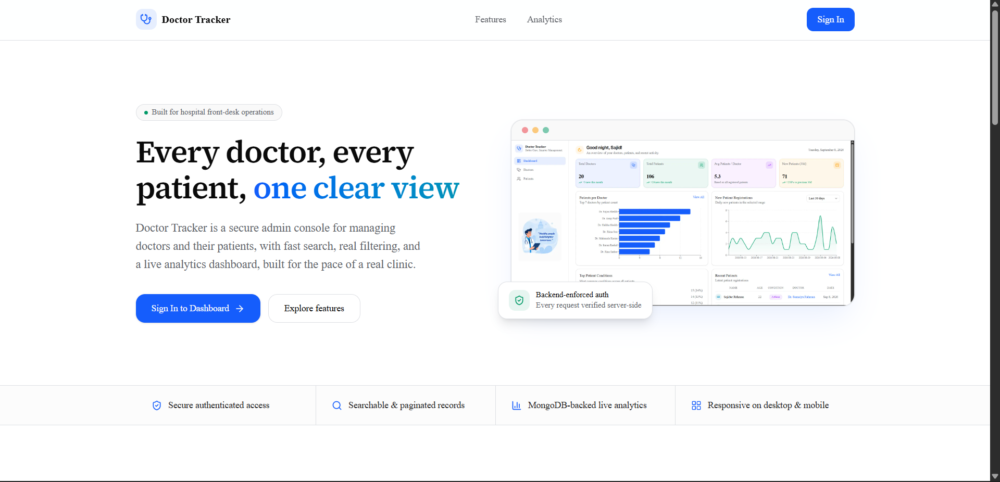</td>
<td width="50%"><b>Login</b><br>Email/password with show/hide toggle<br>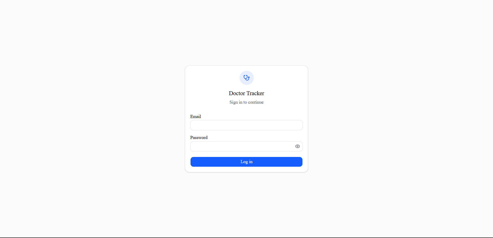</td>
</tr>
<tr>
<td><b>Dashboard</b><br>Stat cards, charts, condition breakdown<br></td>
<td><b>Doctors</b><br>Search, filters, and pagination<br>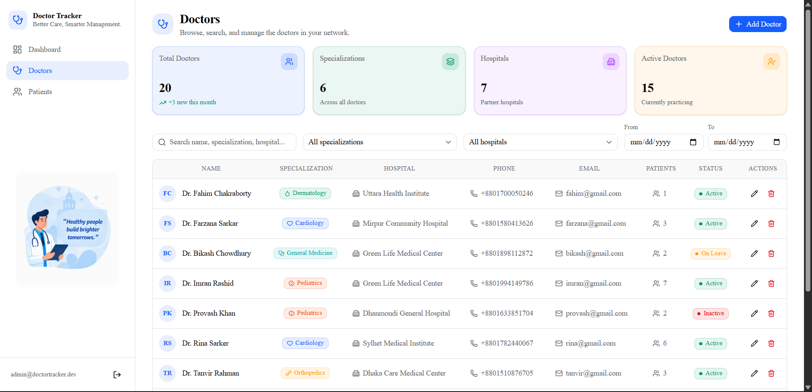</td>
</tr>
<tr>
<td><b>Doctor detail</b><br>That doctor's patients, add/delete inline<br>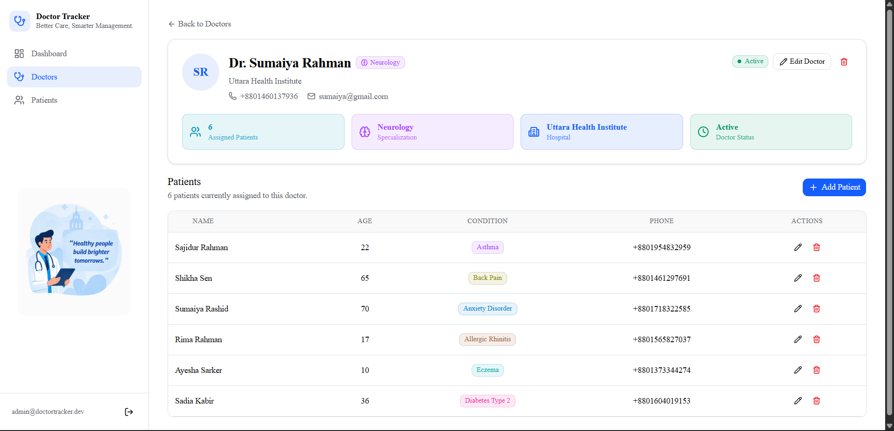</td>
<td><b>Patients</b><br>Cross-doctor view, inline edit + reassign<br>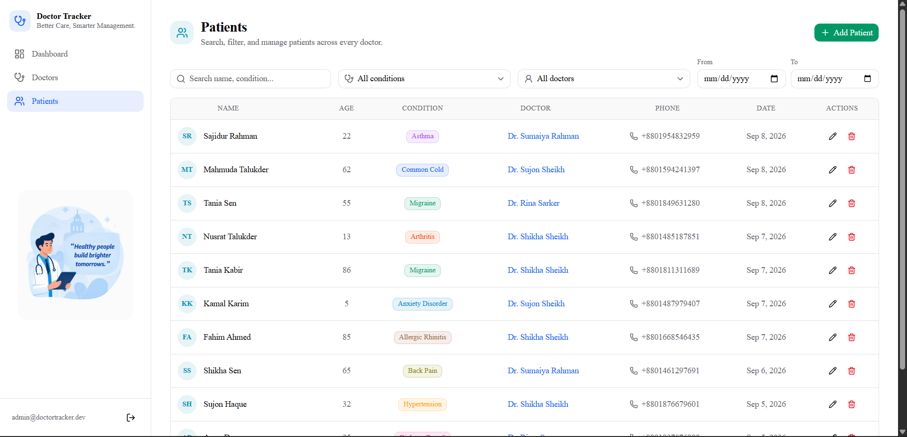</td>
</tr>
<tr>
<td><b>Add Doctor</b><br>Create form, validated client and server side<br>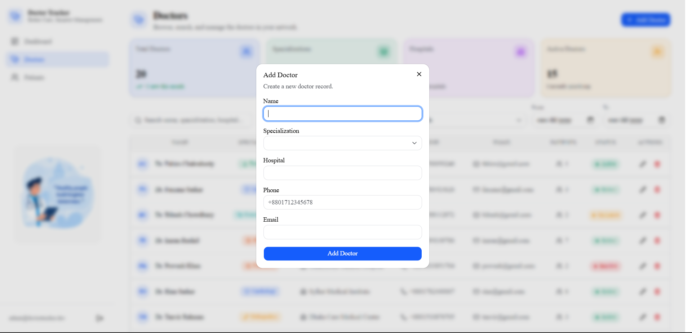</td>
<td><b>Add Patient</b><br>Create form with a doctor picker<br>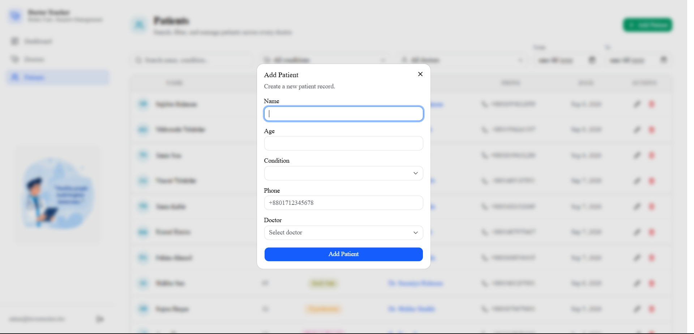</td>
</tr>
</table>

**Mobile** — same pages at a real 390px-wide viewport, no horizontal overflow, nav collapses to a working hamburger menu.

<table>
<tr>
<td>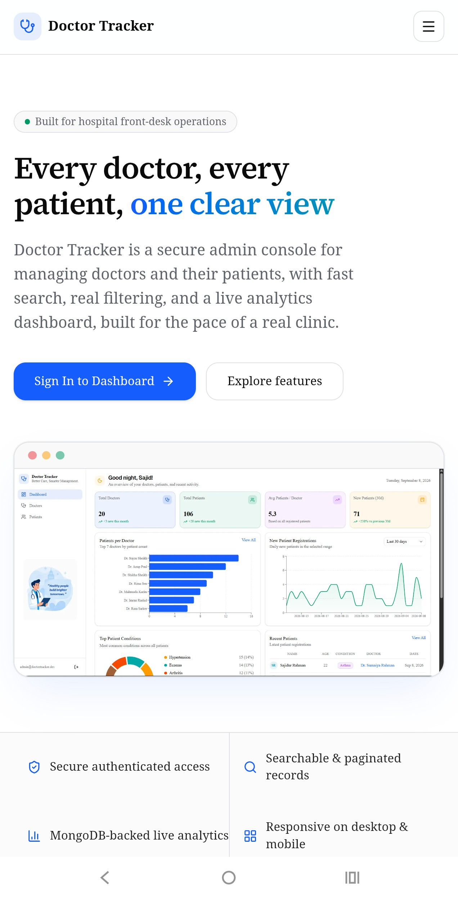</td>
<td>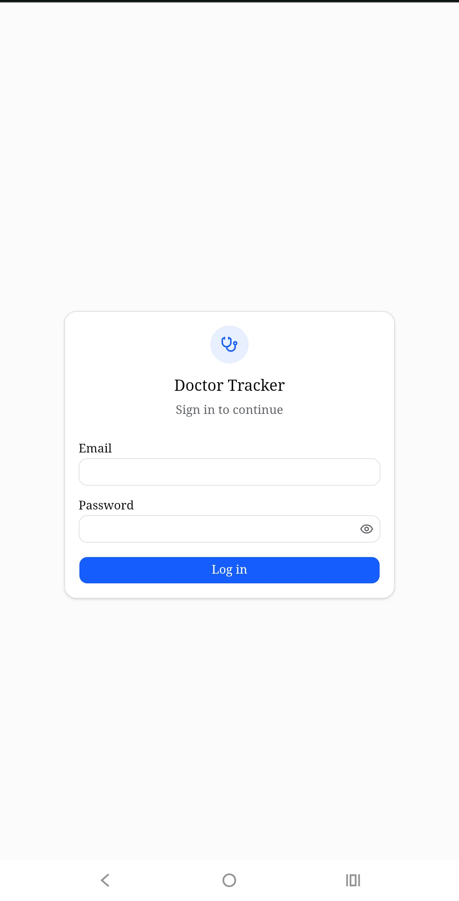</td>
<td>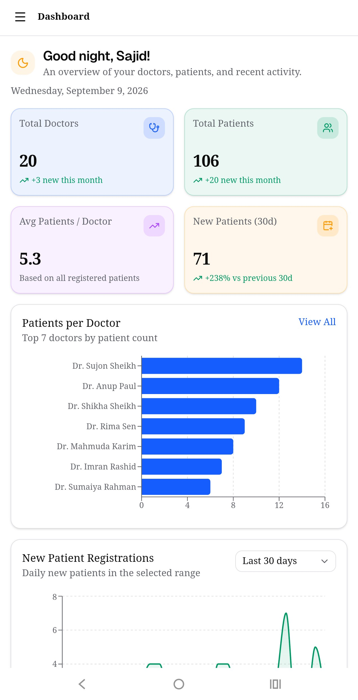</td>
</tr>
<tr>
<td>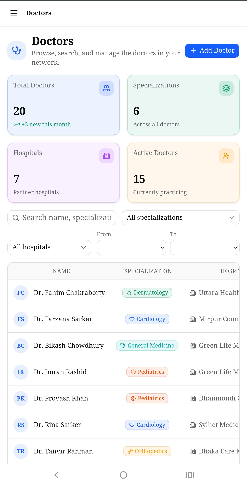</td>
<td>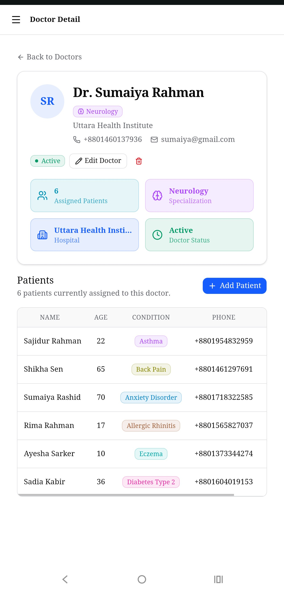</td>
<td>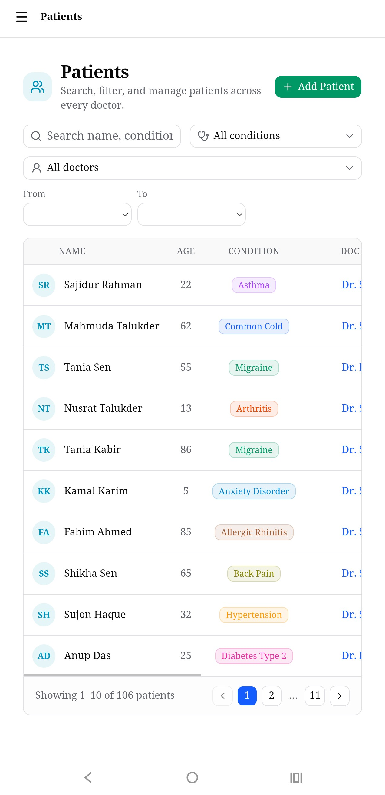</td>
</tr>
</table>

## Repository Links

- **Repository:** [github.com/Saji-d/doctor-tracker](https://github.com/Saji-d/doctor-tracker) — a single repo, `backend/` and `frontend/` as subfolders
- **Backend deep dive:** [`backend/README.md`](backend/README.md) — full technical decisions, API table, indexing detail
- **Frontend deep dive:** [`frontend/README.md`](frontend/README.md) — full technical decisions, visual evidence writeup
- **Live app:** https://doctor-tracker-web.vercel.app
- **Live API:** https://doctor-tracker-backend-jn3d.onrender.com
- **Demo admin login:** `admin@doctortracker.dev` / `admin1234`
