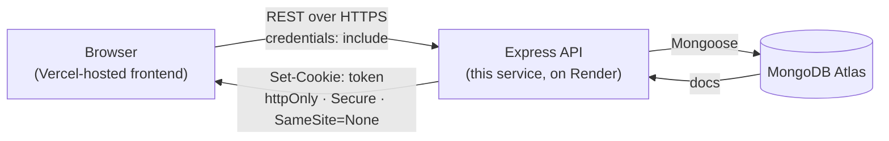

# Doctor Tracker — Backend


**Live API:** [`doctor-tracker-backend-jn3d.onrender.com`](https://doctor-tracker-backend-jn3d.onrender.com) · **Health check:** [`/health`](https://doctor-tracker-backend-jn3d.onrender.com/health)

## Description

Doctor Tracker's backend is a standalone REST API that gives a hospital admin a single, secure place to manage doctors and the patients assigned to them. It owns every piece of business logic and every security decision in the system — authentication, validation, pagination, search, filtering, and the dashboard's analytics — so the frontend can stay a thin, purely presentational client. Built with Express and TypeScript on top of MongoDB, it's designed around three things this kind of admin tool actually needs: data that's provably correct (validated at the boundary, never trusted from the client), queries that stay fast as the dataset grows (deliberate indexing, checked with `explain()` rather than assumed), and an auth model that survives the fact that the frontend and backend live on two different domains in production.

## System Architecture



**Request lifecycle** for any protected route: `cors` middleware checks the request's `Origin` against `FRONTEND_URL` → `requireAuth` verifies the JWT signed into the `token` cookie → the route's Zod schema validates the body/query → the controller calls a service function that runs an indexed Mongoose query → the response is shaped as `{ data, pagination }` (lists) or the resource itself → any thrown error is caught by a single centralized error middleware and returned as `{ error: { message, code } }`, never a raw stack trace.

**Why the backend, not the frontend, decides who's logged in** — full write-up in [Technical Decisions](#technical-decisions) below, but the short version: this API and its frontend are deployed on two different domains (`onrender.com` / `vercel.app`), so there is no cookie the frontend could ever read even if it wanted to. The backend is the only party that ever inspects the JWT.

**Collections:** `users` (one seeded admin, no public registration), `doctors`, `patients` (`doctorId` reference lives on the patient — the "many" side — so both "this doctor's patients" and "all patients" are simple indexed queries, with no risk of hitting MongoDB's 16MB document cap the way an array-of-patients-on-doctor design would eventually).

## API Overview

| Method | Route | Auth | Notes |
|---|---|---|---|
| `POST` | `/api/auth/login` | – | Rate-limited (5 attempts / 15 min / IP); generic error for both wrong-email and wrong-password |
| `POST` | `/api/auth/logout` | ✅ | Clears the cookie |
| `GET` | `/api/auth/me` | ✅ | The only way the frontend learns it's authenticated |
| `GET` / `POST` | `/api/doctors` | ✅ | List (search / specialization / date-range / pagination) and create |
| `GET` | `/api/doctors/:id` | ✅ | Single doctor |
| `GET` / `POST` | `/api/doctors/:id/patients` | ✅ | That doctor's patients; create a patient under them |
| `GET` | `/api/patients` | ✅ | Cross-doctor list (search / condition / doctor / date-range / pagination) |
| `PATCH` / `DELETE` | `/api/patients/:id` | ✅ | Edit (including reassigning doctors) / delete |
| `GET` | `/api/dashboard/summary` | ✅ | `?range=7d\|30d\|90d` — see note below |

**Dashboard note:** `totalDoctors`, `totalPatients`, and `patientsPerDoctor` are always computed across *all* data; only `dateTrend` is scoped to `?range`. They're four independent queries run in parallel (`Promise.all`), not one `$facet` pipeline — a `$facet` branch can't use an index, which would have forced `dateTrend` to give up the one index that actually helps it.

**Indexes:** text indexes on `doctors{name,specialization,hospital}` and `patients{name,condition}` for search; `doctors{specialization}` and `doctors{createdAt}` for filters/sort; `patients{doctorId,createdAt}` (compound) for the hottest query in the app — a doctor's patient list, paginated; `patients{condition}` and `patients{createdAt}` for the patients page's filters.

## Tech Stack

Node.js · Express 5 · TypeScript · Mongoose (MongoDB) · Zod (validation) · JWT + bcryptjs (auth) · `express-rate-limit` + `helmet` (hardening) · Jest + Supertest + `mongodb-memory-server` (tests)

## Setup Guide

**Prerequisites:** Node.js 20+, a MongoDB connection string (Atlas free tier works fine).

```bash
git clone https://github.com/Saji-d/doctor-tracker.git
cd doctor-tracker/backend
npm install
cp .env.example .env   # then fill in the values below
```

`.env.example`:

```dotenv
MONGODB_URI=mongodb+srv://<user>:<password>@<cluster>.mongodb.net/doctor-tracker
PORT=4000
ADMIN_EMAIL=admin@doctortracker.dev
ADMIN_PASSWORD=<choose-a-strong-password>
JWT_SECRET=<random-64+-char-string>
FRONTEND_URL=http://localhost:3000
NODE_ENV=development
```

```bash
npm run seed   # creates the admin user + sample doctors/patients (idempotent)
npm run dev    # starts on http://localhost:4000, watches for changes
```

Other scripts: `npm run build` (compile to `dist/`), `npm start` (run the compiled build), `npm test` (Jest integration suite against an in-memory MongoDB — no real database needed).

## Technical Decisions

### 1. The backend is the sole authentication boundary — not a preference, a consequence of the deployment topology

The frontend and this API are deployed on two different domains. A cookie is only ever visible to the domain that set it, so once that split exists, there is no version of "check the cookie in Next.js middleware" that can work — the frontend's own server never receives a cookie scoped to a different domain, regardless of `httpOnly`. So the design here isn't "frontend guards the UI, backend double-checks" — it's that only the backend ever looks at the token at all. Every protected route runs `requireAuth`, which verifies the JWT's signature and expiry and rejects with `401` otherwise; the frontend's own route guard is pure UX (skip a flash of protected content), never enforcement, and bypassing it (curl, disabled JS, devtools) still hits a backend that independently 401s. The token itself is delivered as `httpOnly; Secure; SameSite=None` — `SameSite=None` is required, not optional, specifically because the browser still has to attach the cookie on cross-origin `fetch` calls from the frontend's pages; that's a separate concern from the frontend being able to *read* it.

### 2. Dashboard aggregation: four parallel queries instead of one `$facet` pipeline

An earlier draft of this API put every dashboard metric inside a single `$facet` aggregation with one leading `$match` on the date range — which quietly scoped *every* branch to that range, including `totalPatients` and `totalDoctors`, which are supposed to be all-time counts. Rather than just moving the `$match`, the fix was to stop using `$facet` for this at all: none of its branches can use an index, so the one branch that legitimately benefits from an index (`dateTrend`, filtered by `createdAt`) would have had to give it up for no reason. `Promise.all([Doctor.countDocuments(), Patient.countDocuments(), patientsPerDoctorAgg, dateTrendAgg])` runs four independently-optimal queries concurrently, and the controller still returns exactly one JSON body — the frontend still makes exactly one HTTP call. The tradeoff being made explicitly, not glossed over: `patientsPerDoctor`'s `$group` is an unavoidable collection scan (nothing indexes "group by doctorId across every document"), which is fine at this project's scale and wouldn't have been fixed by `$facet` either.

## Project Links

- **Live API:** https://doctor-tracker-backend-jn3d.onrender.com
- **Live frontend:** https://doctor-tracker-web.vercel.app
- **Repository:** https://github.com/Saji-d/doctor-tracker (this API lives in `backend/`; the frontend in `frontend/` — see the [frontend README](../frontend/README.md))
- **Demo admin login:** `admin@doctortracker.dev` / `admin1234`

> Render's free tier spins the API down after inactivity — the first request after a while can take up to ~50s to wake it back up.
