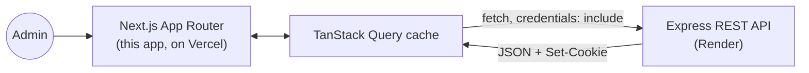
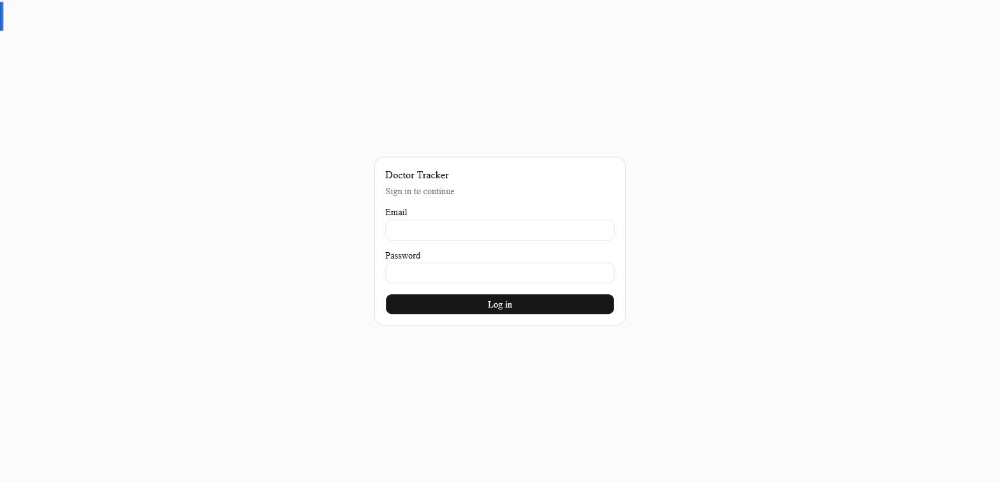
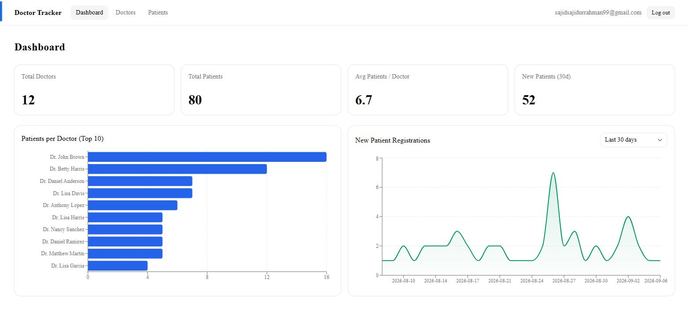
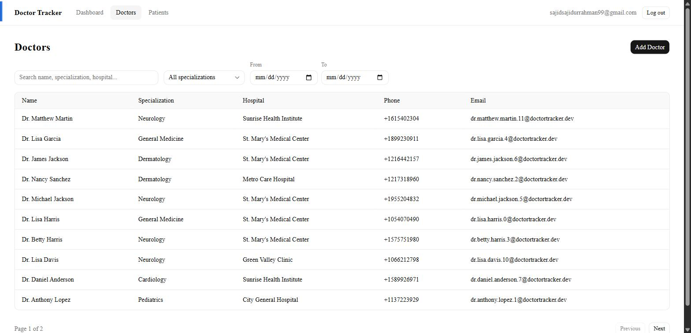
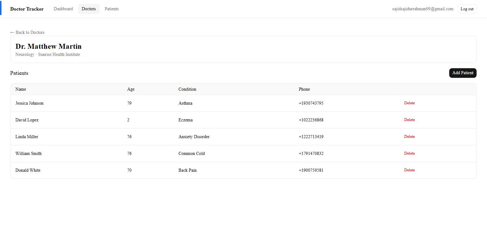
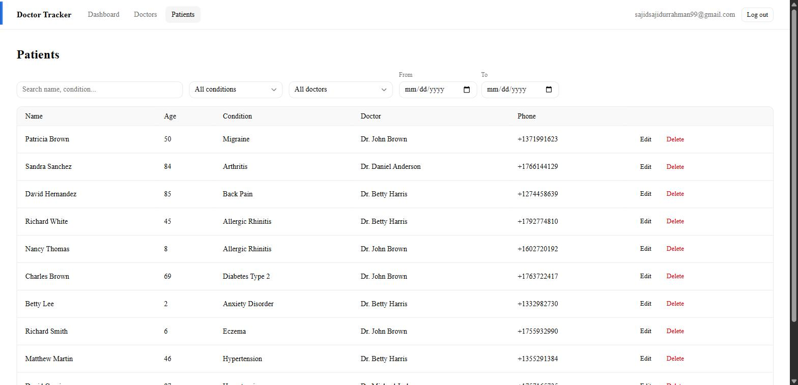

# Doctor Tracker — Frontend


**Live app:** [doctor-tracker-web.vercel.app](https://doctor-tracker-web.vercel.app)

## Description

Doctor Tracker is a secure admin console for a hospital's front desk: log in, see a live dashboard of doctors and patients, and manage both from clean, searchable, paginated tables. It's the client half of a two-app system — a Next.js single-page-feeling app that never touches the database or a password hash directly, and instead does everything over REST against the standalone [Express API](../backend/README.md). The build leans on Next.js's App Router for routing and layout composition, TanStack Query for every piece of server state (so loading/error/caching are solved once, not per-page), and shadcn/ui + Tailwind for a UI that's meant to look like a real internal tool rather than a CRUD scaffold — clean spacing, skeleton loading states, real empty/error states, and a dashboard with genuinely readable charts.

## System Architecture



Every page is a client component backed by a `useQuery`/`useMutation` hook (`useDoctors`, `usePatients`, `useDashboard`, …) that wraps a thin `fetch` wrapper (`lib/api-client.ts`) pointed at `NEXT_PUBLIC_API_URL`. There's no server-side data fetching and no Next.js API routes standing in for backend logic — this app talks to the real backend over REST, the same way any other client would. Auth state is a single `useQuery(['auth','me'])` in `AuthProvider`: on load it asks the backend "am I logged in?", and the `(dashboard)` route group's `<AuthGuard>` redirects to `/login` if not — a UX nicety, not a security boundary (see [Technical Decisions](#technical-decisions)). Filters and pagination are mirrored into the URL's query string, so a filtered, paginated view is bookmarkable and survives a refresh.

## Setup Guide

**Prerequisites:** Node.js 20+, the backend running locally (see [`../backend/README.md`](../backend/README.md)) or its live URL.

```bash
git clone https://github.com/Saji-d/doctor-tracker.git
cd doctor-tracker/frontend
npm install
cp .env.example .env.local   # then point it at your backend
```

`.env.example`:

```dotenv
NEXT_PUBLIC_API_URL=http://localhost:4000/api
```

```bash
npm run dev    # http://localhost:3000
```

Log in with whatever admin credentials you seeded on the backend (`npm run seed` there creates one from `ADMIN_EMAIL`/`ADMIN_PASSWORD`), or use the live demo credentials in [Project Links](#project-links).

Other scripts: `npm run build` / `npm start` (production build), `npm run lint`, `npm test` (Jest + Testing Library component tests).

## Technical Decisions

### 1. The frontend never inspects the auth cookie — it asks the backend instead

This app and its API are deployed on different domains. Cookies are scoped to the domain that sets them, so no matter what runs on the frontend's own server — Next.js middleware included — it will never see a cookie the backend set on its own domain; that's not a hardening gap to close, it's how cookies work. So there's deliberately no `middleware.ts` here checking for a session cookie. Instead, `AuthProvider` mounts once near the app root and calls `GET /auth/me`: `isSuccess` means authenticated (and gives us the user), `isError` (a `401`) means it isn't. The `(dashboard)/layout.tsx`'s `<AuthGuard>` reads that context and redirects to `/login` when unauthenticated — but this is explicitly a UX convenience (skip flashing protected content), not the actual security control. Someone bypassing it entirely — curl, devtools, JS disabled — still hits a backend where every route independently verifies the JWT and 401s without one. Framing it this way (rather than "frontend guards, backend double-checks") keeps the mental model honest about where the real boundary is.

### 2. TanStack Query for all server state — no Redux, no hand-rolled global store

Almost everything this app renders is server state: doctors, patients, dashboard numbers, the logged-in user. TanStack Query already solves caching, loading/error states, and cache invalidation for exactly that, keyed by the full filter/pagination combination that produced it — so a mutation (add a patient, edit a doctor) just calls `queryClient.invalidateQueries(['patients'])` and every view showing that data refetches, without any manual "update this list in three places" bookkeeping. A Redux-style global store would mostly duplicate that cache while adding boilerplate (actions, reducers, selectors) for state that was never really *client* state to begin with — the only genuinely client-only state in this app (a search box's in-progress keystrokes, whether a modal is open) lives in ordinary `useState`, which is what it's for. The one shared Context in the whole app is `AuthProvider`, and it's a thin wrapper around a single query, not a hand-built state machine.

## Visual Evidence

**Login**



**Dashboard** — stat cards plus a patients-per-doctor bar chart and a date-trend area chart; the range selector only ever changes the trend chart, never the totals (see the backend README's [dashboard technical decision](../backend/README.md#technical-decisions) for why that matters)



**Doctors** — search, specialization filter, date-range filter, and pagination, all combinable



**Doctor detail** — that doctor's patients only, scoped by the route param, add/delete inline



**Patients** — the cross-doctor view, with condition + doctor filters and inline edit/delete



> **Mobile screenshots:** the sandboxed browser tool used to build this project can't actually resize its rendered viewport (confirmed via `window.innerWidth` staying fixed regardless of the resize call), so genuine phone-width screenshots couldn't be captured here. Responsive behavior was instead verified by code review and one real bug found and fixed that way: the nav bar overflowed horizontally below ~500px (fixed with `flex-wrap` + responsive padding — `frontend/src/components/layout/NavBar.tsx`), and the data table (`overflow-x-auto`) and filter bar (`flex-wrap`) were already correctly responsive from when they were built. If you have a moment, resizing your own browser window below ~500px on any page here is the quickest way to confirm it directly.

## Project Links

- **Live app:** https://doctor-tracker-web.vercel.app
- **Live API:** https://doctor-tracker-backend-jn3d.onrender.com
- **Repository:** https://github.com/Saji-d/doctor-tracker (this app lives in `frontend/`; the API in `backend/` — see the [backend README](../backend/README.md))
- **Demo admin login:** `admin@doctortracker.dev` / `admin1234`

> The backend is on Render's free tier, which spins down after inactivity — the very first request against a cold instance (e.g. right after opening the live app) can take up to ~50s before login responds.
